# 깃 협업 사용법

## 1. 브랜치 생성

- 브랜치는 일종의 작업실이라 생각하면됨
- main이라는 회사가 있고 무언가 작업을 할 때 작업실을 만들어서 따로 작업한 후 로비에서 합치는 느낌?

- New branch  생성
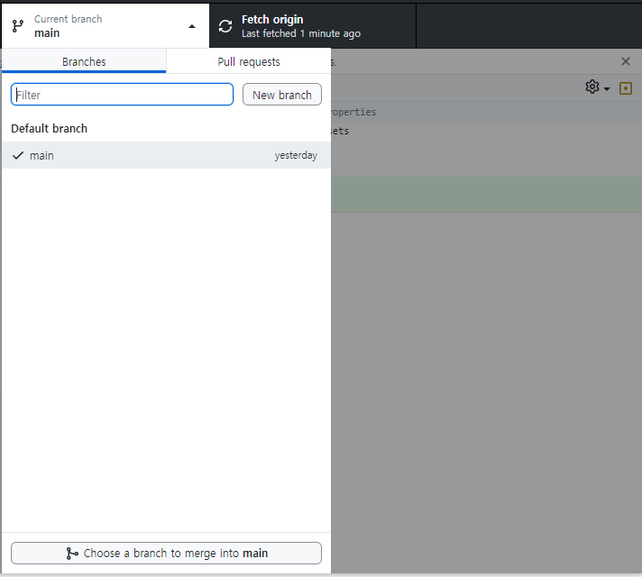

- 브랜치명 작업 내용
- ex) feat/playerMove, hotfix/mobAi
  - feat = /뒤에 작성된 작업을 하는 브랜치를 만들거다, hotfix = / 뒤에 작성한 부분이 ㅈ버그가 터져서 급하게 수정을 하기위해 브랜치를 만들거다
  - playerMove = 이거 관련된 작업을 할거다
  - / 뒤는 자유롭게 작성하면 됨 근데 feat, fix, refector 등 앞에 붙는거는 국룰로 정해진게 있으니까 제대로 정해서 할거면 깃 컨벤션이라고 검색해서 찾아보셈 
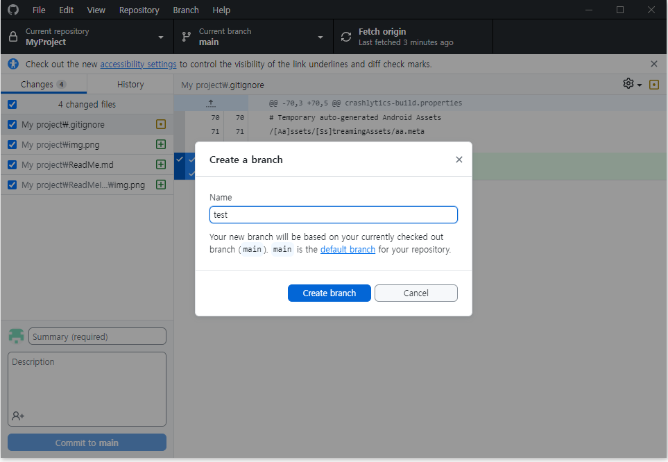

- 브랜치 이동
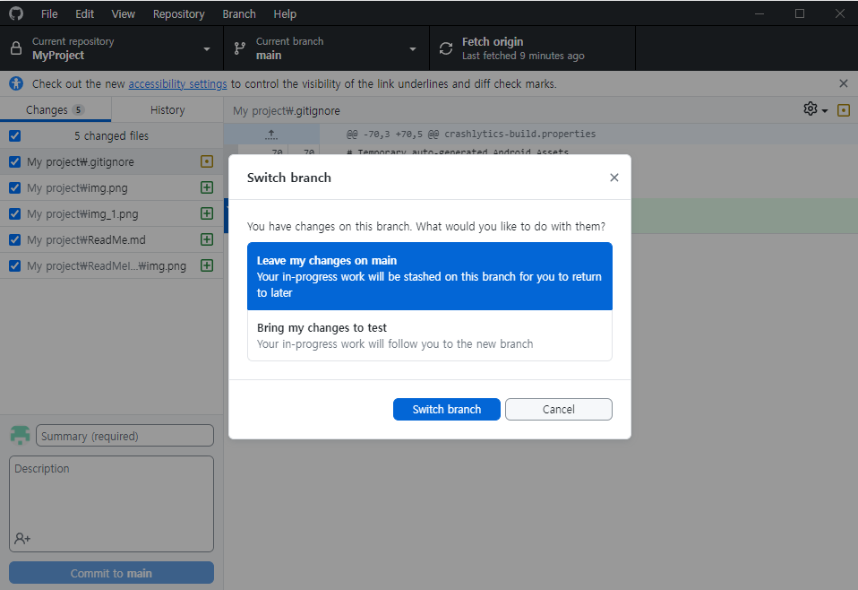

- 현재니가 위치한 main이라는 이름의 브랜치에서 새로 만든 브랜치로 이동할거라는 거임
  - 사진은 내가 브랜치 만들면서 캡쳐따는거라 바뀐 내용들 버릴지 가져갈지 선택하라고 뜨는 거임
  - 절대 절대 절대 브랜치 만들기 전에 main에서 작업하지마 이거 꼬이면 원복힘들어짐
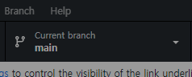

## 2. 작업 후 커밋 or stash

- 3번에 쓸 rebase라는 작업을 하기전에 커밋이나 stash를 해야하는데 이건 선택임 근데 난 stash를 선호하긴함

### stash 하는법 

- git bash 열기
- open git bash here
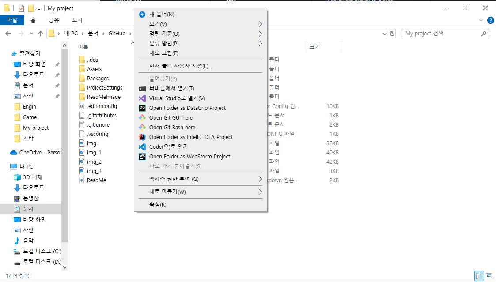

- 작업한 내역들이 changes에 보임
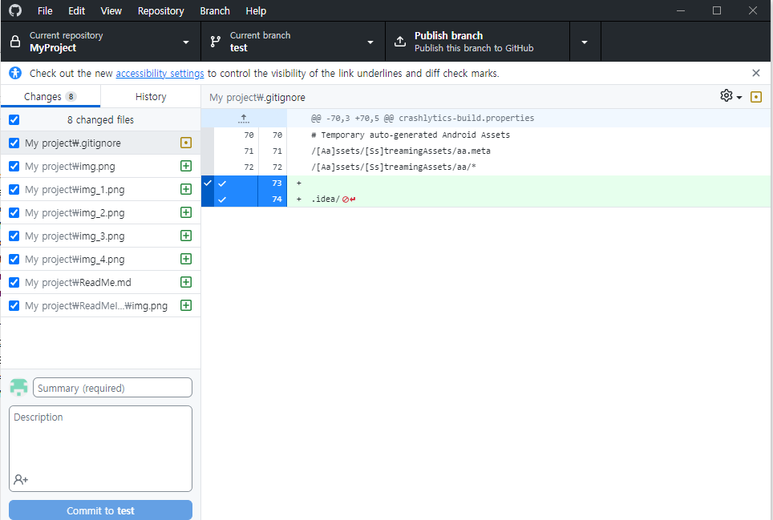

- 터미널에 명령어 입력
  ```
  git stash
  ```
  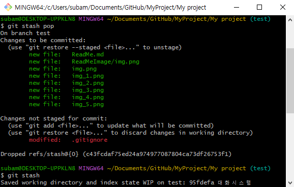
- stash 후 작업한 내용들이 사라짐 잠깐 다른곳에 임시저장 하는 느낌?
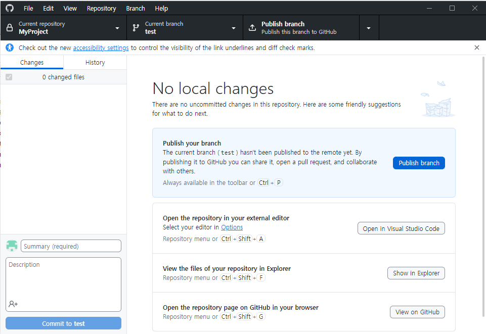

### commit

- 이건 기존에 하던대로 하면됨
  - 이것도 약간 정해진 국룰같은거 있긴한데 제대로 할거면 찾아보셈 브랜치 명만드는거랑 비슷함

  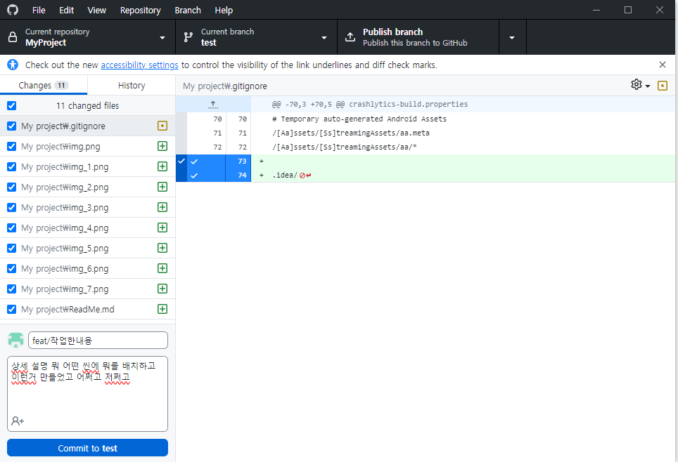

## 3. Rebase
### 2번에서 stash를 하든 commit을 하든 둘중 하나는 꼭 하고 해야됨

- main 브랜치로 돌아가기
- 깃 데스크탑에서 main 클릭 or git bash 열어서 명령어 입력
  ```
  git checkout main
  ```
  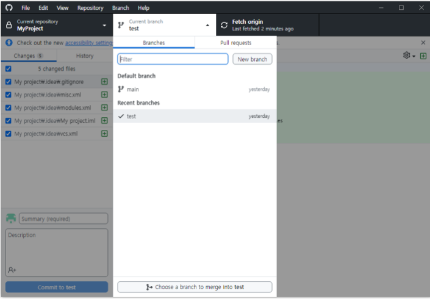

- main 최신화
- 아마 상황마다 다를 텐데 그냥 위에 3번쨰 칸에 있는 fetch origin 누르면됨 fetch 아님 pull 어쩌고 있을거임
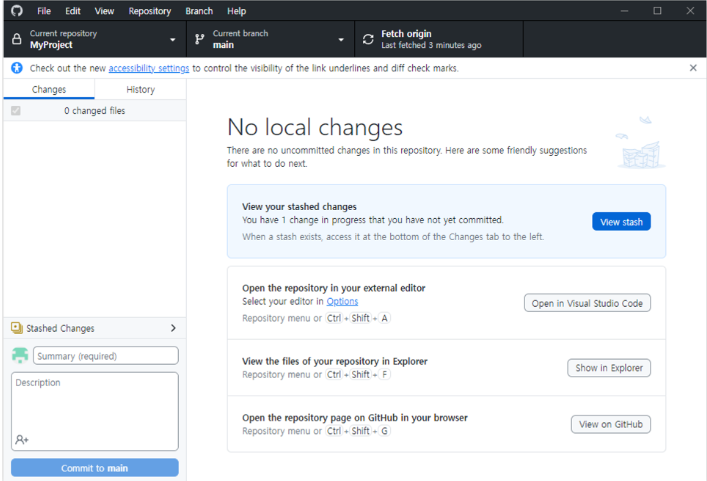
- 터미널 명령어
  ```
  git pull
  ```
- 작업 하던 브랜치로 돌아가기
- 위에서 한거처럼 깃 데스크탑에서 브랜치 클릭 or git bash 열어서 명령어 입력
  ```
  git checkout test ## test 자리에 너가 작업하던 브랜치 이름 쓰면됨
  ```
  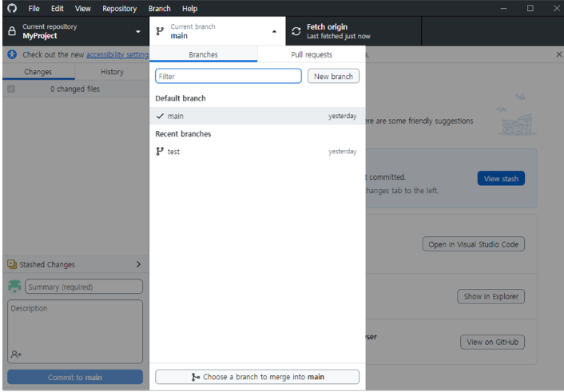

- git rebase
- 이건 데탑에서는 못찾겠다 그냥 명령어 써라
  ```
  git rebase main
  ```

- git stash pop
- 2번에서 stash 해왔으면 다시 꺼내줘야됨
  ```
  git stash pop
  ```
## 4. 커밋 후 푸쉬
- 2번에서 커밋했으면 그냥 바로 푸쉬하고 스태쉬했으면 커밋하고 푸쉬하면됨

## Pull Requests

- 너가 작업한 브랜치를 main 브랜치에 합치는 과정